<style>
BODY {
    font-family: 'BIZ UDPMincho', serif;
}
</style>
# 婦人科悪性腫瘍総合入力システム<br/>JESGO(Japan entry system of gynecologic oncology)

<table style="margin-top: 5rem; margin-left: auto; margin-right: auto;">
<tr><td>proof</td><td>2021-11-05 山本(P4mohnet)</td></tr>
<tr><td>Version 1.0</td><td>2022-01-03 山本(P4mohnet)</td></tr>
<tr><td>Version 1.1</td><td>2022-02-03 山本(P4mohnet)</td></tr>
<tr><td>Version 1.2</td><td>2022-03-31 山本(P4mohnet)</td></tr>
</table>

## 0. 履歴
### Version 1.0 初版
### Version 1.1
- スキーマ拡張 jesgo:childschema の追加
- 性別テーブルのスキーマ修正
- 5.1 ドキュメントのvalidationについて記載を追加、それに伴い番号の振り替えあり
- データのvalidationのエラーを保存するため、ドキュメントプロパティ jesgo:error を追加
### Version 1.2
- 症例テーブルに死亡日のフィールドを新設
- jesgo:ui:subschemastyle のデフォルトを noindent に修正、tab を新設

## 1. システムの背景と目的
現在、特に婦人科悪性腫瘍領域においては1つの施設が行う症例登録業務が多岐にわたっている。登録業務では、各施設で保有する症例台帳などを参照し症例を抽出し、診療録や各種記録に基づき各学会の入力様式にあわせて入力を行っている。年次で行われる症例登録では入力様式の変更が生じたり、あらたな調査が行われるとそれにあわせてあらためて症例の抽出からの作業を行うこととなり負担が大きい。<br/>
この登録業務は主に各施設の実務を担う若手から中堅が行っており、その業務軽減は今後労働基準法の遵守を突きつけられた産科婦人科領域において喫緊の課題である。<br/>
婦人科悪性腫瘍総合入力システムは、現場の登録に関する業務負担の軽減と、将来策定される臨床研究における情報管理の基盤となるプラットフォームとして開発されるものである。

## 2. 用語の定義
#### データベース
運用施設において保存される情報のこと。

#### 端末
ユーザが操作を行うハードウエア。

#### アプリケーション
ユーザが、端末からデータベースの操作を行うためのインターフェースをアプリケーションと称する。

#### サーバ
アプリケーションを通じて端末がデータベースにアクセスするために接続するソフトウエア群の総称。

#### サーバ装置
専らサーバを稼働させるためのハードウエア。

#### システム
今回開発されるサーバとアプリケーションから構成されるデータベースの管理および操作を行うためのパッケージの総称。

#### レコード
データベースにおいて保存される患者情報の単位。1患者1レコードが原則。

#### テーブル
データベースにおいて管理される情報の単位。

#### ドキュメント
データベース内での情報管理の単位。

#### フィールド
テーブルやドキュメントを構成する情報項目の単位。規定された形式の情報を保持する。

#### スキーマ
ドキュメントとして登録されるデータ様式の構成の一部について、その内容と形式を規定したもの。情報の項目名とその形式、選択式項目の場合はその選択候補、必要であれば内容のチェック式などを保持する。

#### ビュー
ユーザがドキュメントを入力・参照する際にどのように表示されるかを規定したもの。

#### スクリプト
ドキュメントにアクセスし、情報の抽出、導入を行うためのプログラム。

#### 提出データ
データベースより抽出加工され、学会などの調査において提出するためのデータ。

#### プラグイン
データベースに対して、あらたなスキーマやビューの導入や、ドキュメントから提出データを作成するための動作スクリプト、提出データの検証スクリプトなどを内包したもの。

#### カスタマイズ
データベースに対して、あらたなスキーマを運用施設において独自に導入すること。プラグインの機能の一部。

## 3. システムの要件
### 3.1. アプリケーションの機能要件
アプリケーションによりデータベースにスキーマに従ったドキュメントを入力し、任意の形式もしくはプラグインで規定された形式でデータベースから情報を抽出しファイルもしくは帳票として出力する。<br/>

### 3.1.1. ドキュメントの構成
レコードの内容は階層的であり、各階層の内容にあたるドキュメントはスキーマで規定される。<br/>
レコードにおける特に配慮を要する個人情報についてはスキーマで構成されるドキュメントとして管理せず、データベースのテーブルとして保持する。このテーブルの内容へスキーマやビュー、プラグインのスクリプトからの直接参照は禁止する。しかし、レコードを参照する際にこのテーブルから計算された定数を参照可能とする。<br/>
スキーマは、そのスキーマの親となりうるスキーマへの単一の参照情報を持つ。よって、親となるスキーマはあたらにプラグインなどで導入される子スキーマに対して知りうる必要は無い。<br/>
レコードの最上位にあたるドキュメントのスキーマは親情報を持たない。レコードの各階層における子の出現順位は維持され、ユーザが順位を変更することが可能である。また、同一スキーマは規定されたドキュメントは同一階層で複数存在することが許容されるが、単一での存在を宣言することも可能である。<br/>
スキーマからは、抽出式を利用して同一レコード中の別のドキュメントの内容を参照することが可能である。<br/>
スキーマは、年次もしくは適宜更新されることがある。過去の入力についてはそのデータの発生イベントの時点で適切なスキーマが選択される。スキーマの更新により違反が生じた場合、アプリケーションは必要であれば情報の修正をユーザに要求する。<br/>
<br/>
ビューはスキーマと連携しドキュメントの画面構成を行う。ビューが特段定義されていない場合は、ドキュメント内容を視認性に配慮してドキュメントおよびスキーマの内容を列挙し画面を構成する。<br/>

### 3.1.2. プラグイン
スキーマおよびビューは、学会が認証したプラグインとして導入されるほか、運用施設において独自のプラグインを用いることでカスタマイズが可能である。また、プラグインにより、特別に表示に特化したビューを用意し、各施設での帳票作成に利用可能とする。<br/>
プラグインには提出データなどデータ抽出や、必要に応じて外部データを用いてレコードのバッチ修正を行うスクリプトを内包可能で、スクリプトがレコード中のドキュメントにアクセスするAPIはスキーマ全体の管理情報と併せて公開される。<br/>
プラグインによるレコードからの抽出については、抽出される情報について個人情報に十分配慮した検証がなされる必要がある。プラグインは、学会に研究計画とともに提出された要件に応じて指定デベロッパーが開発と検証を行うか、仕様に基づき外部で開発されたものを指定デベロッパーが検証を行う。公式のプラグインは、最終的に学会が認証し配布する。施設独自のプラグインについてはその限りではない。<br/>

### 3.1.3. データの出力
データベースからの抽出は、実施可能な端末、ユーザの権限について各施設で任意に制限できるようにする。<br/>
抽出の形式は運用施設で抽出式による任意形式の指定、もしくはプラグインにより規定された提出データとする。<br/>

### 3.1.4. サーバの障害対策
障害対策としてデータベースは、入力もしくは更新がなされた1日単位でバックアップを作成し、最低で7世代のバックアップとレストアを可能とする。バックアップ先はOSが標準的にもつ機能の範疇でアクセス可能な場所を、運用施設で用意し運用する。アプリケーションが保存先への接続などの操作は担わない。<br/>
また、バックアップに際してはドキュメントの患者情報に違反がないかの検証を行うことが望ましい。<br/>

### 3.2. サーバおよびアプリケーションの稼働要件
各施設において、導入と運用にあたり費用およびメインテナンスを要するサーバ装置を設置すること無く、単一もしくは複数の端末から複数のユーザで利用が可能なもの。運用にあたり専任の技術者を不要とせず、操作マニュアルの範疇で一般のユーザがOSのシステム管理者権限を持たずとも導入と管理できるもの。<br/>
端末のOSは、Windows10以降(64bit)とmacos10.13以降(intel 64bit, Apple siliconは任意)を対象とする。スマートフォンやタブレットは対象としない。端末の画面解像度は1366x768ピクセル以上とし、ストレージ容量については32GBytes以上の余裕は必須とする。OSによる操作感の差違は最低限に留める。<br/>
端末からサーバへの接続に際してwebブラウザを使用する場合、互換性を重視しChromiumベースのブラウザを動作対象とする。  
  
オンラインアップデートに必要な端末のインターネットへの接続は、導入施設のポリシーによるため任意とする。  
また、複数端末からの利用に際し性能を維持するために同時接続数を制限することを許容する。また、クライアントライセンスのOS上でアプリケーションをサーバとして動作させた場合に発生しうる同時接続数の制限についても同様に許容する。  

### 3.3. オープンソースソフトウェアの利用
使用するライブラリ等にオープンソースソフトウェアコンポーネントの利用は、そのライセンスに抵触しなければ開発にあたり使用を妨げない。<br/>
一方で、プロプライエタリなソフトウェアコンポーネントを利用する際ライセンスに抵触することは許容されない。

## 4. データベース
### 4.1. データベースの構成概要
スキーマによりドキュメントが構成されるため、データベースは基本的にアプリケーションの動作に関わるユーザ認証と設定に関するテーブル、個人を手特定するレコードに対する起点となるテーブルおよび、ドキュメントとスキーマを管理するテーブルで構成される。そのほか、アプリケーションおよびサーバの動作に必要な情報を保持するテーブルを必要に応じて用意する。<br/>
本仕様要求におけるデータベース構成は、あくまで設計の理念であり設計について強制をするものではない。<br/>

### 4.2. データベースの構成
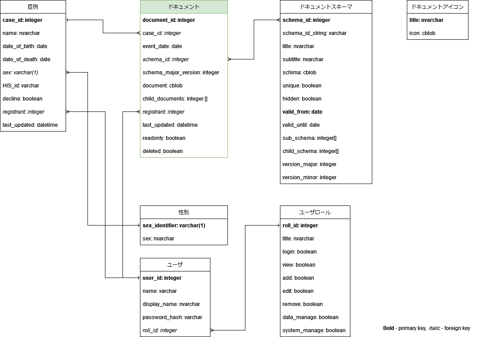

### 4.3. テーブルの定義
#### 4.3.1. 症例テーブル
|コラム名|型|属性|解説|
|:--|:--|:--|:--|
|case_id |整数,シリアル値 |PK |内部で使用する患者ID |
|name |文字列 | |患者名 |
|date_of_birth |日付 |NOT NULL |患者の生年月日 |
|date_of_death |日付 | |患者の死亡(確認)年月日 |
|sex |文字(3) |FK, default 'F' |患者の性別 |
|HIS_id |文字列 |UNIQUE, NOT NULL |施設での患者ID |
|decline |ブール |default FALSE |臨床試験登録拒否を表明しているか否か |
|registrant |整数 |FK |最終更新登録者ID |
|last_updated |タイムスタンプ |NOT NULL |最終更新タイムスタンプ |

患者を容易に特定しうる特に重要な個人情報を保持するテーブルなのでドキュメントとは明確に分離する。<br/>
施設での患者IDをもちいて重複登録を回避する。患者IDの入力様式はハイフネーションなどに対する扱いが施設毎に異なるため、システム環境設定で設定できることが望ましい。<br/>
<br/>
ドキュメントからは生年月日のみ参照可能とするが、直接参照は認めない。レコード内で、指定のイベント(event_date)との間の差分を年齢にあたる年単位、月単位などで算出した値を参照する。<br/>
提出データのレコード照合を行う為にレコードのユニーク値である HIS_id, date_of_birth の2つを用いてハッシュ値を必要時に算出する。ハッシュソルトはシステム環境設定において保存され一定でユーザからの一切の変更を受け付けない。ハッシュ値は個人情報保護のため対応表を保持しないことが求められるので、ドキュメントへの保存は容認されない。また、ハッシュ値でレコード検索を可能にする。<br/>

#### 4.3.2. ドキュメントテーブル
|コラム名|型|属性|解説|
|:--|:--|:--|:--|
|document_id |整数,シリアル値 |PK |内部で使用するドキュメントID |
|case_id |整数 |FK, NOT NULL|ドキュメントの紐付く 患者ID |
|event_date |日付 | |ドキュメントイベントの日付 |
|document |文字データ |NOT NULL |スキーマに沿って記録されたドキュメント情報(JSON) |
|child_documents |整数[] |FKs |このドキュメントの下の階層を構成するドキュメントのドキュメントIDを保持した配列 |
|schema_id |整数 |FK, NOT NULL |ドキュメントを構成する スキーマのID |
|schema_major_version |整数 | |スキーマのメジャーバージョン |
|registrant |整数 |FK |最終更新登録者ID |
|last_updated |タイムスタンプ |NOT NULL |最終更新タイムスタンプ |
|readonly |ブール |default FALSE |編集禁止フラグ |
|deleted |ブール |default FALSE |削除済みフラグ |

患者に関するツリー構造のドキュメント構成を管理するテーブル。親ドキュメントに連なる複数の子ドキュメントへの参照を保持し文書を構成する。  
event_dateは、ドキュメント内の日付情報とあわせて設定される。event_dateがNULLのドキュメントは、親ドキュメントのevent_dateを継承する。  
readonly, deleted フラグの設定はドキュメントの削除権限を持つユーザのみ設定できる。また、これらのフラグは暗黙的に子ドキュメントにも継承される（子ドキュメントに対する再帰的設定は必須としない）。  
  
スキーマには有効期間が設定されており、event_dateがスキーマの有効期間にあることが必須である。何らかの原因でドキュメントに対応する有効なスキーマが存在しない場合、そのスキーマを用いたドキュメントの作成、変更は許容されない(readonlyとして扱われる)。この仕様は、期間が限定されている臨床研究などに対応するためのものである。
  
バックアップなどの際に、child_documentsの参照するドキュメントIDのcase_idに不整合が生じないように定期的にエラーチェックを行う。  

#### 4.3.3. ドキュメントスキーマテーブル
|コラム名|型|属性|解説|
|:--|:--|:--|:--|
|schema_id |整数 |PK |スキーマID |
|schema_id_string|文字列 | |JSONスキーマの$id |
|title |文字列 | |スキーマが定義するドキュメントのタイトル(JSONスキーマのtitleから生成) |
|subtitle |文字列 | |スキーマが定義するドキュメントのサブタイトル(JSONスキーマのtitleから生成) |
|document_schema |文字データ(JSON) |NOT NULL |スキーマ定義内容 |
|unique |ブール |default FALSE |同一階層にこのスキーマで定義されるドキュメントは最大1つしか存在できない(JSONスキーマのjesgo:unique) |
|hidden |ブール | |候補として表示しない |
|subschema |整数[] | |このドキュメントの下位として標準的に展開されるスキーマのスキーマID(初期値はJSONスキーマのjesgo:subschemaから検索、継承スキーマでの置き換えに限り編集可能、順序は保持される) |
|child_schema |整数[] | |このドキュメントの下位として展開されうるスキーマのスキーマID(初期値はJSONスキーマのjesgi:subschema, jesgo:childschema, jesgo:parentschemaから検索して生成、編集可能、順序は保持される) | 
|base_version_major |整数 | |継承スキーマの場合、基底スキーマのメジャーバージョンを明示する |
|valid_from |日付 |PK, default '1970-01-01' |ドキュメントスキーマの有効期間開始日(JSONスキーマのjesgo:vaild[0]) |
|valid_until |日付 | |ドキュメントスキーマの有効期間終了日(JSONスキーマのjesgo:valid[1]) |
|author |文字列 |NOT NULL |スキーマの作成者名(JSONスキーマのjesgo:author) |
|version_major |整数 |NOT NULL |スキーマのメジャーバージョン(JSONスキーマのjesgo:versionの上位数値) |
|version_minor |整数 |NOT NULL |スキーマのマイナーバージョン(JSONスキーマのjesgo:versionの下位数値) |
|plugis_id |整数 |FK |このスキーマを導入したプラグインのID |

schema_id = 0 は患者情報レコードエントリーを示すマジックナンバーとしてシステム内で扱われる。 
   
ドキュメントの内容はスキーマで規定され、ユーザの入力により生成されたドキュメントを保存する。  
ドキュメントに対応するスキーマは、スキーマidとドキュメントのevent_dateで検索が行われて適宜最適なものが選択される。
  
スキーマの規定するドキュメント種別を示すためtitleが利用される。スキーマ中の"title"が利用されるが、title中にwhitespaceがあるばあい、最初のwhitespaceまでをtitleに格納され、whitespace以降がsubtitleに格納される。スキーマの"title"命名についてはこの点を十分留意して行う必要がある。  
  
スキーマに有効期間が設定されている場合、ドキュメントのevent_dateがその期間内にあることが求められる。
スキーマのバージョンは、メジャーバージョンが更新された場合は再入力が必須となるよう操作を依頼し、マイナーバージョンの変更は表記などの変更や必須ではない項目の追加など軽微な変更で内容の確認・修正程度のものを示す。  
  
child_schema には、ドキュメントの下位に生成されうるスキーマの schema_id を保持する。スキーマ中の"jesgo:parentschema","jesgo:subschema","jesgo:childschema"に基づき検索され child_schema は設定される。  
subschema は、下位ドキュメントとして強く要求されるため、編集時に内容の有無にかかわらず展開される。初期値として、スキーマ中の"jesgo:subschema"で"$id"を前方一致で検索しそのスキーマの schema_id を保持する。subschema には、該当するスキーマの schema_id が保存される。  

ドキュメントの生成の際には、下位のスキーマのうちevent_dateでフィルタリングしたものが利用される。

#### 4.3.4. ドキュメントアイコンテーブル
|コラム名|型|属性|解説|
|:--|:--|:--|:--|
|title |文字列 |PK |対応するスキーマのタイトル |
|icon |文字データ | |アイコンのデータ |

ドキュメントに対応するアイコンのデータを保持するテーブル。  
リスト画面での一覧表示の際にドキュメントに応じて表示されるアイコン情報。  

#### 4.3.5. 性別テーブル
|コラム名|型|属性|解説|
|:--|:--|:--|:--|
|sex_identifier |文字(1) |PK |性別を示す1文字で表記されたID |
|sex |文字列 |NOT NULL |性別を表記する文字列 |

あまり必要になら無いとは思われるが、こんな時代で将来何が起こるかわからないので一応用意しておく。  
  
|sex_identifier |sex |
|:--|:--|
|F |女性 |
|M |男性 |
|N |記載なし |
|1 |MTF |
|2 |FTM |

#### 4.3.6. ユーザテーブル
|コラム名|型|属性|解説|
|:--|:--|:--|:--|
|user_id |整数 |PK |ユーザのID |
|name |文字列 |NOT NULL |ログイン時に使用するユーザ名 |
|display_name |文字列 | |アプリケーション使用時に表示されるユーザ名 |
|password_hash |文字列 | |パスワードをハッシュ化したもの |
|roll_id |整数 |FK, NOT NULL |ユーザの権限設定内容への外部参照 |

ユーザ認証に用いるテーブル。  
平文パスワードは保持せず、システム固有のハッシュソルトでハッシュ化されたパスワードを保持する。パスワード空白時の挙動はシステム設定で管理される。
ユーザ毎の権限はユーザロールテーブルで管理される。

#### 4.3.7. ユーザロールテーブル
|コラム名|型|属性|解説|
|:--|:--|:--|:--|
|roll_id |整数 |PK |権限管理のID |
|title |文字列 |NOT NULL |権限の名称 |
|login |ブール | |ログイン可能 |
|view |ブール | |ドキュメントの閲覧が可能 |
|add |ブール | |ドキュメントの追加が可能 |
|edit |ブール | |ドキュメントの編集が可能 |
|remove  |ブール | |ドキュメントの削除が可能 |
|data_manage |ブール | |データの統括管理可能 |
|system_manage |ブール | |システム管理可能 |

ユーザ権限には login - システムの使用の可否、view - 閲覧の可否、add - レコート・ドキュメントの追加の可否、edit - レコード・ドキュメントの内容変更の可否、remove - レコード・ドキュメントの削除の可否、data_manage - データの書きだしなどの作業の可否、system_manage - システム設定変更の可否 を想定する。  
アプリケーションのデータ管理は、ユーザがどの権限を持つかを判断して動作する。  
  
運用施設のポリシーにあわせてされるが、大旨以下のような設定が基本として想定される。  

|roll_id |title |login |view |add |edit |remove |data_manage |system_manage |
|:--|:--|:-:|:-:|:-:|:-:|:-:|:-:|:-:|
|0|システム管理者 |TRUE |TRUE |TRUE |TRUE |TRUE |TRUE |TRUE |
|1|システムオペレーター |TRUE |FALSE |FALSE |FALSE |FALSE |FALSE |TRUE |
|100|上級ユーザ |TRUE |TRUE |TRUE |TRUE |TRUE |TRUE |FALSE |
|101|一般ユーザ |TRUE |TRUE |TRUE |TRUE |FALSE |FALSE |FALSE |
|1000|退職者 |FALSE |FALSE |FALSE |FALSE |FALSE |FALSE |FALSE |

#### 4.3.8. システム設定テーブル
その他システムの動作に関わる設定を保持するもの。スクリプトやプラグインの管理も含まれる。  
アプリケーションの設計に応じて必要な項目を保持する。システム管理権限を持つユーザのみ変更可。  

## 5. ドキュメント
スキーマは、ドキュメントのフィールド名とその値の規則、検証ルール、またいくつかの付随情報を規定する。原則としてスキーマ定義から表示及び入力のフォーム画面は自動生成される。  
スキーマには有効期間があり、ドキュメントが日付情報をもち、その日付情報が更新された場合は常にスキーマが有効であるか確認して適切なスキーマに変更される。その他入力内容についても、入力される度にvalidationが行われフォーム画面の動的生成の制御が適切に行われる。  

### 5.1. ドキュメントのvalidation
ドキュメントのvalidationは以下の2つに大別される。  
入力に際しては、ドキュメント保存にあたって項目の値が required か否か、日付・文字列などのフォーマットが妥当かの最低限の内容のvalidationが行われる。内容の妥当性については求めない。jesgo:requiredでの登録に関する必須項目指定があっても、フィールドの強調表示に留め確認の上で保存不可などの対応は行わない。  
内容の妥当性のvalidationは、出力様式によって規定されるため出力プラグインのvalidationスクリプトが行う。しかし、validationにおいて発生したエラーは、1つの症例に対して複数のドキュメントに分散して存在している。エラーはプラグインスクリプトによりドキュメント中に jesgo:error に保存される。その内容はドキュメントを表示・編集する際に表示される。ドキュメント中の jesgo:error は、指定項目の変更にともなうドキュメントの変更・保存に伴い一度削除される。  

### 5.2. スキーマの記載について
json schema https://json-schema.org/draft/2020-12/schema に準じて規定する。ただし、使用するライブラリの対応において限度があるため　Draft2019-09 以上をサポートするものとする。  
jesgo独自の機能拡張としてスキーマ中にはスキーマ属性と、フォームの自動生成を制御するためのボキャブラリを"jesgo:"を接頭辞として定義する。  
拡張には、スキーマ自身の属性を示すもの、ドキュメントのフィールド設定に関わるもの、フィールドのフォーム展開を制御するもの、フィールドとデータベース間の情報の交換を定義するものがある。  
  
json schemaの記載と運用にあたり以下を規定する。
- "$id" は "/schema" を接頭辞とし、スキーマの有効期間・バージョンが異ならない限り一意である。
- "$id":"/schema/foo/bar" は "$id":"/schema/foo" を継承した派生スキーマであり、"/schema/foo"の内容を包括している必要がある。
- "title" はドキュメントのタイトルを示す。プラグインやスキーマ中での参照に対応するため、親ドキュメントのプロパティとの重複に注意する。スキーマ導入、ツリー編集に際してはそのチェックを行う。
- "description" はドキュメントにおいては、ドキュメント冒頭で画面に表示される。フィールドではヘルプとして表示される内容を保持する。
- "required" は、フォームが記録される最低限のルールを定めたものである。
- スキーマの記述において、json schemaにおける "$ref": "uri" を用いた外部ファイルを用いたサブスキーマの利用は利用しない。スキーマ内部でのサブスキーマ項目の規定には用いることができる。
- "readonly" が指定されたフィールドは表示されるがフォーカスされず編集不可能な項目として表示される。また、"const"や後述する"jesgo:get"、"jesgo:ref"などによる固定値の指定が必須である。"if"を用いたスキーマによる条件分岐で値を設定することは許容される。

### 5.3. ボキャブラリーの拡張
JESGOの拡張ボキャブラリーは以下に定義と解釈を提示する。

#### 5.3.1. jesgo:valid
スキーマの有効期間を示すタプル。  
/0 に有効期間開始日  
/1 に有効期間終了日  
を記載する。/0は必須である、空白文字列として省略された場合1970-01-01と解釈する。  
ドキュメントのeventdateが有効期間内であるものが選択される。

```
{
    "jesgo:valid": [ "2021-11-01" ],
    "$comment": "2021年11月1日から有効"
},
{
    "jesgo:valid": [ "2019-01-01", "2021-10-31" ],
    "$comment": "2019年1月1日から2021年10月31日まで有効"
},
{
    "jesgo:valid": [ "", "2021-10-31" ],
    "$comment": "2021年10月31日まで有効. JSONの制約により要素0を省略できない."
}

```

#### 5.3.2. jesgo:version
スキーマのバージョンを示す文字列。メジャーバージョン番号.マイナーバージョン番号で記載する。  
メジャーバージョンの変更は、内容の大幅な拡張を示し必須入力フィールドの増加などの際に更新される。  
マイナーバージョンは上記以外のenumやoneOfに列挙される内容や、順番、コメントなどの微細な変更でデータ出力などに影響を及ぼさない場合に変更する。

```
{
    "jesgo:version": "1.1"
}
```

#### 5.3.3. jesgo:baseversion
継承スキーマにおいて基底スキーマのバージョンを示す文字列。最低限メジャーバージョンを指定する。  
基底スキーマと継承スキーマの間でバージョンの相違が生じた場合、継承スキーマは無効化(hidden)される。

```
{
    "jesgo:baseversion": "1.0"
}
```

#### 5.3.3. jesgo:parentschema
ドキュメントの親ドキュメントのスキーマを$idの配列で指定する。管理データベースでは、この値を元に親ドキュメントの child_schema をスキーマ導入などの設定時にスキャンして設定する。  
"/"はレコード定義そのものを指し、トップレベルに存在するドキュメントはこれを指定する。  
スキーマ$idの指定には最低限のワイルドカードが使用可能である。
```
{
    "jesgo:parentschema": [
        "/"
    ],
    "$comment": "トップレベルドキュメントは必ずこの表記が必要"
},
{
    "jesgo:parentschema": [
        "/schema/foo"
    ]
},
{
    "jesgo:parentschema": [
        "/schema/*/bar"
    ]
},
{
    "jesgo:parentschema": [
        "/schema/foo/*bar"
    ]
},
{
    "jesgo:parentschema": [
        "/schema/foo/bar*"
    ]
},
```

#### 5.3.4. jesgo:subschema
ドキュメントを構成するために必要な下位ドキュメントのスキーマを配列で指定する。下位ドキュメントは必ずしも入力が必須ではないが、空白であっても自動的に展開される。展開に際しては、定義された順番に展開される。基本的に、jsgeo:subschema で指定されるスキーマは、jesgo:parentschema でこのスキーマを指定していることが望ましい。  
管理テーブルのsubschemaの初期設定は、この内容に基づき設定される。スキーマ管理で、指定されたドキュメントを継承した派生スキーマに置換することも可能である。  
jesgo:parentschemaと同様にワイルドカードが使用できる。  

#### 5.3.5. jesgo:childschema
ドキュメントの下位となり得るドキュメントのスキーマを配列で指定する。jesgo:childschemaに指定されていなくても、jesgo:subschemaは下位ドキュメントとして展開される。  
施設において管理ユーザの指定により管理テーブルにより、ここで指定されているドキュメントの作成をユーザに選択させないことも選択出来る。  
jesgo:parentschemaと同様にワイルドカードが使用できる。  

#### 5.3.6. jesgo:error
ドキュメントの理論チェック(プラグインで実行されることを想定している)の結果、生じたエラーを配列(array)で保持するプロパティ。  
ドキュメント全体に影響するものはstring、フィールド(プロパティ)に関するものは { "プロパティ名": "string" } のオブジェクトで記録される。
```
{
    ...
    ...
    "jesgo:error": [
        "このドキュメントにはエラーがあります.",
        {
            "進行期": "記入がありません."
        },
        {
            "別の進行期": "進行期と整合がとれません."
        }
    ]
}
```

#### 5.3.6. jesgo:unique
ドキュメントがあるドキュメントの子ドキュメントとして1つしか存在できないことを示す。  
データベースの unique にコピーされる。

#### 5.3.7. jesgo:required
フィールドを必須として要求する登録データセットの名称を指定する配列。  
現時点では、日産婦腫瘍登録 JSOG と内視鏡学会手術合併症登録 JSGOE の2つしかない。

#### 5.3.8. jesgo:error
プラグインの検証スクリプトで作成されたエラーの内容を保存する配列。配列にはドキュメント全体に関わるもの、フィールドに対するものがありそれぞれ適当な方法でエラーを表示する。  

```
{
    ...
    "jesgo:error": [
        "ドキュメント全体に関わるエラーメッセージ",
        {
            "fieldA": "フィールドAに対するエラーメッセージ"
        },
        {
            "fieldB": "フィールドBに対するエラーメッセージ",
            "fieldC": "フィールドCに対するエラーメッセージ"
        }
    ]
}
```

#### 5.3.9. jesgo:get
フィールドの値として、データベースからの参照値を引用する。  

- eventdate 当該ドキュメントのeventdate日付文字列
- age 当該ドキュメントのeventdate時点での患者年齢
- month 当該ドキュメントのeventdate時点での患者月齢
- week 当該ドキュメントのeventdate時点での患者週齢
- day 当該ドキュメントのeventdate時点での患者日齢

#### 5.3.10. jesgo:ref
フィールドの値として、自信もしくは他のドキュメントを参照する。
ドキュメントの参照は JSON pointer を用いる。JSON pointerでのドキュメント参照は、プラグインへのレコード参照に準ずる。

```
{
    "properties": {
        "fieldA": {
            "type": "srting"
        },
        "fieldB": {
            "type": "string",
            "default": {
                "jesgo:ref": "#/properties/fieldA"
            }
        },
        "fieldC": {
            "type": "string",
            "const": {
                "jesgo:ref": "/患者台帳/がん腫"
            }
        }
    },
}
```

#### 5.3.11. jesgo:set
ドキュメントを保存する際に、フィールドの値をデータベースの指定項目として設定する。

- eventdate 当該ドキュメントのeventdate  
この項目に限り常に監視され、変更の度にスキーマの選択整合性確認に使用される。
- death 患者死亡フラグの設定(保存・変更の際に確認ダイアログを表示する)
- recurrence 再発フラグの設定(保存・変更の際に確認ダイアログを表示する)

#### 5.3.12. jesgo:ui:disabled
フィールドの表示属性。ブール値。trueでグレーアウトで表示し、編集を不可とする。

#### 5.3.13. jesgo:ui:enabledwhen
フィールドの表示属性。指定した条件を満たしていない場合、グレーアウトで表示し編集を不可とする。
条件はJSON pointerを用いたドキュメントフィールドの指定と内容の比較とする。

#### 5.3.14. jesgo:ui:subschemastyle
サブスキーマフィールド(オブジェクト形式のフィールド)の表示設定を指定する。

- row 入力コラムに行形式で展開する
- noindent 縦方向に入力項目を通常のコラムに並べて展開する(デフォルト)
- inline 横方向に入力項目を並べて展開する
- tab ドキュメントの設定プロパティとしてのみ設定可能～jesgo:childschema, jesgo:subschemaや定義テーブルを用いてドキュメントの直下に作成される子ドキュメントをタブ形式で展開する.(/の直下に展開されるドキュメントと同様)

#### 5.3.15. jesgo:ui:hidden
フィードの表示属性。表示しない。値の入力ができないので、定数("default")の設定が必須である。

#### 5.3.16. jesgo:ui:hidetitle
ドキュメント、フィールドのタイトルを表示しない。

#### 5.3.17. jesgo:ui:listtype
フィールドの表示属性。選択肢からの選択方法を指定する。

- list ドロップダウンリストからの選択(単一選択の場合のデフォルト)
- suggestlist ドロップダウンリストからの選択に加えて、入力ボックスに入力された文字列からの前方一致検索によるリストからの選択
- buttons ラジオボタン・チェックボックスによる選択(配列フィールドの選択肢からの入力のデフォルト)

#### 5.3.18. jesgo:ui:noindent
サブスキーマフィールドの展開において、サブスキーマを入力領域にインデントして展開せずインデントを行わず展開する。

#### 5.3.19. jesgo:ui:textarea
フィールドの表示属性。入力フィールドを複数行入力可能テキストボックスとして設定する。  
true もしくは 行数を指定する。

#### 5.3.20. jesgo:ui:visiblewhen
フィールドの表示属性。指定した条件を満たしていない場合は入力項目として表示しない。  
条件はJSON pointerを用いたドキュメントフィールドの指定と内容の比較とする。

```
{
    "properties": {
        "腫瘍登録対象": {
            "title": "婦人科腫瘍登録対象症例",
            "type": "string",
            "enum": [
                "いいえ",
                "はい"
            ]
        },
        "腫瘍登録番号": {
            "type": [
                "string"
            ],
            "jesgo:ui:visibleWhen": {
                "#/腫瘍登録対象": {
                    "const": "はい"
                }
            }
        },
        "腫瘍登録番号入力者": {
            "type": "string",
            "jesgo:ui:visibleWhen": {
                "allOf": [
                    {
                        "#/腫瘍登録対象": {
                            "const": "はい"
                        }
                    },
                    {
                        "#/腫瘍登録番号": {
                            "pattern": "^(CC|EM|OV)20[0-9]{2}-[1-9][0-9]*$"
                        }
                    }
                ]
            }
        }
    }
}
```

#### 5.3.21. jesgo:ui:width
入力フォーム部分の横幅をCSSの表記に従って設定する。%, px, remの3種類単位が現実的と考える。

### 5.4. スキーマとインターフェースの対応
原則として、スキーマが規定するドキュメントを1つのボックスとして表示する。ブロック冒頭には"title"と"description"が表示され、コントロール用のメニューボックスが表示される。  
メニューボックスの機能は以下を想定する。

- ドキュメントの削除もしくは内容の初期化
- ドキュメントのスキーマを代替(継承)スキーマへ変更
- 子スキーマで規定される子ドキュメントの追加
- ドキュメントの順序入れ替え

#### 5.4.1. 基本的なドキュメントの展開
ドキュメントを規定するスキーマの設定に従う。  
ドキュメントはボックス内に記載され、ボックスにはコントロールボタンが付属する。子ドキュメントは、ドキュメント内のボックスに改めて描画される。

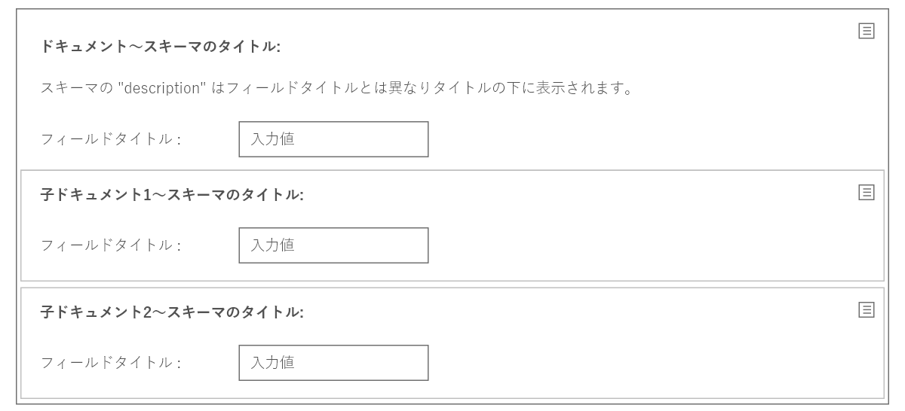

#### 5.4.2. コントロールボタン
コントロールボタンを展開し編集中のドキュメントに対して以下の操作を可能とする。  

- subschemaで指定されて展開されているドキュメントでは内容の初期化、それ以外のドキュメントの場合はドキュメントの削除
- ドキュメントがsubschemaで順序固定で指定されたもの以外の子ドキュメントでは、順序の入れ替え（上下・左右に移動）
- ドキュメントに表示可能な継承スキーマがある場合は、ドキュメントを構成するスキーマ変更指示
- 子ドキュメントの追加(childschemaでかつ表示可能なもの)
- 権限のあるユーザに対しては、ドキュメントの変更不可設定もこのメニューに表示する

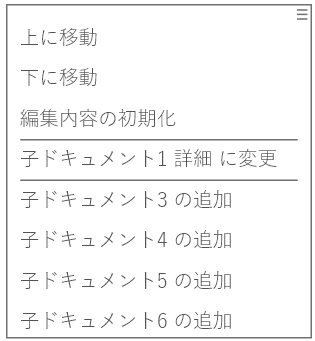
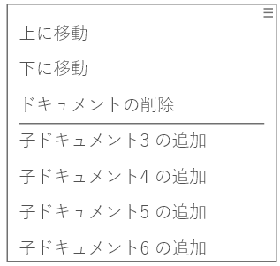

#### 5.4.3. トップレベルドキュメントの展開について
症例登録のトップレベルドキュメント(症例台帳)は、その直接の子のドキュメントは、ユーザの要望によりタブ形式での配置を行う。  
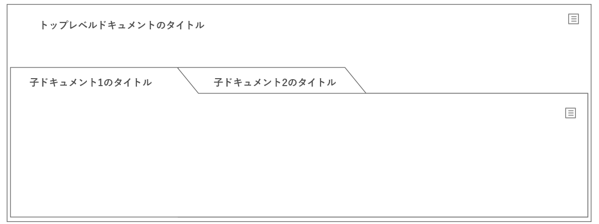

#### 5.4.4. 入力フォーム(入力ボックス)の展開
入力フォームは、2ペインから構成され。左側のペインにフィールドのタイトル(property名称もしくはtitleで指定された内容)と、右側のペインに入力ボックスとなる。入力ボックスの様式は型により変動がある。disableとなっているフィールドについては、フィールド名は通常通りだが、入力ボックス部分をグレーアウトして利用不可とする。  
    
文字列や数値を入力するボックスとしては、テキスト入力、複数行テキストの入力("jesgo:ui:textarea": true)、リストからの選択がある。


単一行の入力ボックスについてはボックス外に単位の記載も可能である。

  
フィールドに指定された description はヘルプ項目となり、フィールドタイトルの脇にヘルプボタンを配置しヘルプを画面にポップアップして入力の際の指示を行う。


ドキュメントとして成立するために必要な項目(required)については、入力ボックスを強調表示する。


一方で、jesgo:required で指定されたデータセットによる必須フィールドについてはユーザからの表示指示があるときにはボックスにラベルを用いて表示する。


入力内容のvaridationでエラーとなる値については、入力ボックスと内容の両者を強調表示する。

    
選択によるテキストなどの値入力は "enum" もしくは "oneOf" で指定された内容をリストに表示し選択する。また、選択の様式は jesgo:ui:listtype で指示される。
- list はドロップダウンリストからの選択のみ行う。
- combo はドロップダウンリストからの選択の他、リストに無い項目を直接入力可能とする。スキーマもそれに対応する必要がある。
- suggestlist はドロップダウンリストからの選択に加えて、入力ボックスへ直接入力された文字列による前方一致検索を行い選択リストを表示する。
- suggestcombo は上記の suggestlist の機能に加えて、リストに無い項目も直接入力可能とする。スキーマもそれに対応して記載する必要がある。
- buttons はリストをラジオボタンもしくはチェックボックス(arrayのitems)で展開する。
  
リストを"oneOf"での列挙を行う場合は候補をツリー構造でグループ化することが可能である。
```
{
    "フィールドタイトル": {
        "type": "string",
        "oneOf": [
            {
                "const": "候補1"
            },
            {
                "title": "候補2タイトル",
                "const": "候補2"
            },
            {
                "title": "候補グループタイトル",
                "enum": [
                    "候補3"
                ]
            }
        ]
    }
}
```

  
上のリストにおいて、"combo"では以下のようにスキーマを記載し、自由入力でのエラーを回避する。
```
{
    "フィールドタイトル": {
        "type": "string",
        "jesgo:ui:listtype": "combo",
        "anyOf": [
            {
                "oneOf": [
                    {
                        "const": "候補1"
                    },
                    {
                        "title": "候補2タイトル",
                        "const": "候補2"
                    },
                    {
                        "title": "候補グループタイトル",
                        "enum": [
                            "候補3"
                        ]
                    }
                ]
            },
            {
                "pattern": "^.+$"
            }
        ]
    }
}
```
  
ボタンの配置では、タイトルのないセクションを設けることで項目を強制的に改段して表示することができる。
```
{
    "フィールドタイトル": {
        "type": "string",
        "jesgo:ui:listtype": "buttons",
        "oneOf": [
            {
                "const": "ラジオボタン1"
            },
            {
                "const": "ラジオボタン2"
            },
            {
                "title": "ラジオボタン3-タイトル指定",
                "const": "ラジオボタン3"
            },
            {
                "title": "セクションタイトル",
                "enum": [
                    "選択肢4"
                ]
            },
            {
                "enum": [
                    "選択肢5"
                ]
                "$comment": "無名セクションので改段できる"
            }
        ]
    }
}
```


#### 5.4.5. 入力フォーム(配列)の展開
"type": "array"は配列フィールドとして展開される。入力項目は動的に増減(minitems,maxitemsの規定は受ける)し、項目には削除ボタンが設置される。また入力項目の順位は任意に変更可能とする。  


  
ボタン型リスト表示については以下に留意する必要がある。"items"に対して"jesgo:ui:listtype":"buttons" を指定した場合、ラジオボタンリストを複数表示するようにレンダリングする。
```
{
    "配列フィールドタイトル": {
        "type": "array",
        "items": {
            "type": "string",
            "jesgo:ui:listtype": "buttons",
            "enum": [
                "選択肢1",
                "選択肢2",
                "選択肢3"
            ]
        }
    }
}
```
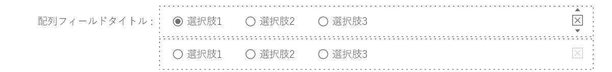
  
一方で、arrayフィールドに対して、"jesgo:ui:lisytype":"button" を指定することでチェックボックスの選択をレンダリングする。
```
{
    "配列フィールドタイトル": {
        "type": "array",
        "jesgo:ui:listtype": "buttons",
        "items": {
            "type": "string",
            "enum": [
                "選択肢1",
                "選択肢2",
                "選択肢3"
            ]
        }
    }
}
```


#### 5.4.6. 入力フォーム(スキーマ内サブスキーマ)の展開
ドキュメント内の object 型フィールドについては、スキーマ内部のサブスキーマを用いて定義される。サブスキーマ部分はボックスとなる。その展開様式は jesgo:ui:subschemastyle で指定する。

- row - 入力カラム部分に縦方向に展開する、標準
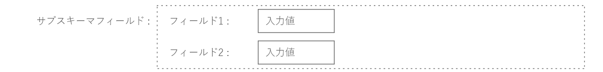
- noindent - 入力カラムにインデントせず縦方向に展開する
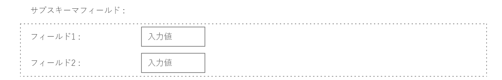
- inline - 入力カラムの行方向に展開する、要素数の少ないオブジェクト向き
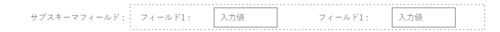
  
object型フィールドも配列フィールドのitemとすることができる。その場合は配列フィールドとして削除・順位操作のコントロールが付加される。
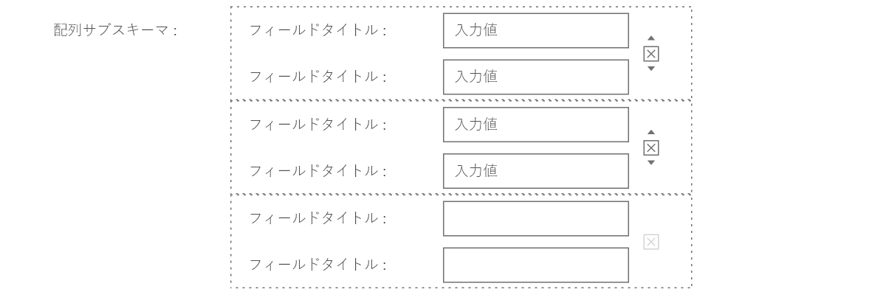

## 6. データベースからのデータ抽出
データベースからのデータ抽出は、個人情報保護の観点からドキュメント単位の抽出を原則とする。  
患者を直接特定可能なトップレベルの情報へのアクセスは、data_manage権限のあるユーザが行うか、data_manage権限のあるユーザが認証したスクリプトを経由して行われる。この抽出操作は、システムにログとして記録される。

## 7. プラグイン
スキーマの拡張や、後述するプラグインの導入を目的にプラグインを利用可能とする。  
プラグインは、zip形式のアーカイブファイルで、プラグインの情報ファイル、スキーマを保存するフォルダ、スクリプトを保存するフォルダからなる。プラグインはサーバ側で保存される。

### 7.1. スクリプト
スクリプトを用いてデータの抽出や、インポート・差分修正などを実装する。スクリプトは、アプリケーションとのインターフェースを通じてレコード情報の取得、ドキュメントの取得・修正を行い、必要であればローカルファイルへの情報書きだしなどを行う。セキュリティ面を考慮して直接的な外部ネットワークとの接続は禁止する。  
  
スクリプトはシステムの都合上javascriptで記載される。また、施設で利用する簡易的な表形式でのレコードの出力に対応しやすいようにJSON形式でドキュメントからの抽出が容易になる簡易的なスクリプトも利用可能とする。  
javascriptからはアプリケーションインターフェースを経由して各レコードもしくはドキュメントをJSON形式で取得し利用する。スクリプトからの要求は JSON pointer を用いて行われる。レコードは、ドキュメントのタイトルをキーとしたたオブジェクトの集合として1つの大きなJSONデータとして再構成されてスクリプトに渡る。  

### 7.1.1. スクリプトにアプリケーションが提供する機能
アプリケーションはスクリプトに対して以下の機能を提供する。
- ローカルファイルへのアクセス
- レコードの検索とドキュメントの生成
- レコードの検索とドキュメントの変更
- スクリプトからの出力を表示・保存・印刷する機能
- いくつかのルールに基づくレコード/ドキュメントに対応するのハッシュ値の生成(JSGOEの症例登録でハッシュアルゴリズムとしてxxHashを利用しているので要対応)
  
スクリプトが利用できる機能はセキュリティ面を考慮して限定される。少なくともレコード単位のアクセスとローカルファイルへのアクセスは、data_manage権限をもつユーザに限定する。

### 7.1.2. スクリプトからの要求
スクリプトによるレコードの抽出は、以下のパターンを想定する。
- 患者IDによるレコードの抽出
- レコードを一意に認識する患者ID、氏名、イベント日付(eventdate)によるハッシュ値
- ドキュメントを一意に認識する患者ID、氏名、eventdateによるハッシュ値
- 指定された期間にドキュメントのeventdateが含まれるもの
- タイトル名の前方一致
- スキーマの$idの前方一致
いずれも、要求に対して指定ドキュメントに子ドキュメントを従えたJSON文字列を生成してスクリプトに渡す。上記以上の絞り込みはスクリプト側で行う。  
渡されたJSON文字列に対してスクリプトにより変更された内容をアプリケーション側でドキュメントの修正として取り込む。この際、新規ドキュメントの作成はできない。  

スクリプトに渡されるドキュメントのJSON文字列は以下のように構成される。ドキュメントのtitleは、スキーマの命名規則に則り"タイトル名 補足タイトル"の場合、"タイトル名"と空白以前の値を用いてドキュメント構造の正規化を図る。

```
{
    "ドキュメントのtitle" : {
        // ドキュメントの内容
        "子ドキュメント1のtitle": {
            // 子ドキュメント1の内容
        },
        "子ドキュメント2のtitle": {
            // 子ドキュメント2の内容
        }
    }
}
```
  
- スクリプトからのレコード要求に対しては以下のようなJSON文字列が渡される。このタイプの実行にはdata_manage権限のあるユーザの承認を必須とする。    
```
{
    "患者氏名": "John Doe",
    "患者ID": "999-999-999",
    "生年月日": "1980-01-01",
    "患者台帳": {
        "がん腫": "子宮体がん",
        ...
        "病期診断": {
            ...
        },
        ...
    },
    "経過情報": {
        ...
    }
}
```

- 複数のレコード・ドキュメントを渡す場合は、arrayとなる。
```
[
    {
        "患者氏名": "John Doe",
        "患者ID": "999-999-999",
        "生年月日": "1980-01-01",
        ...
    },
    {
        "患者氏名": "Foo Bar",
        "患者ID": "999-999-123",
        "生年月日": "1990-12-31",
        ...
    },
    ...
]
```

## 8. 操作画面例
### 8.1. ログイン画面
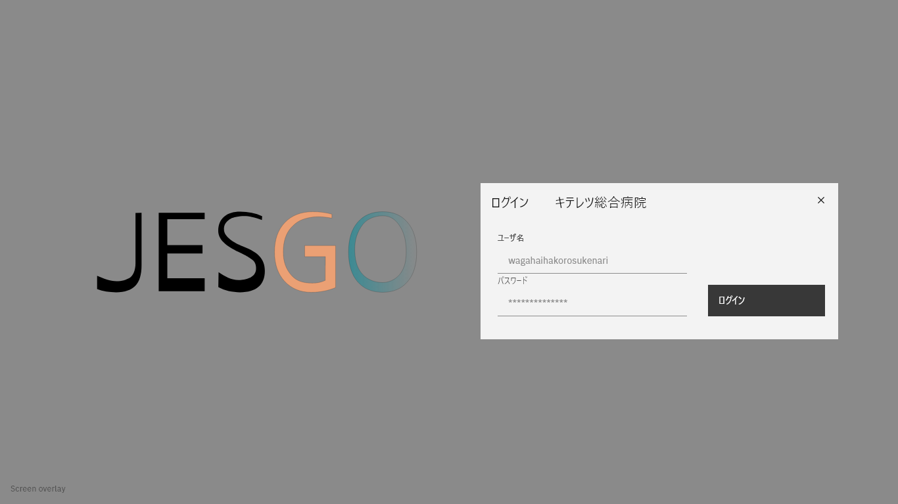
アプリケーションの使用に際して、ユーザはログインを必須とする。  
セキュリティ面から10分程度トランザクションが発生しない場合セッションが切断されることが望ましい。  

### 8.2. リスト画面
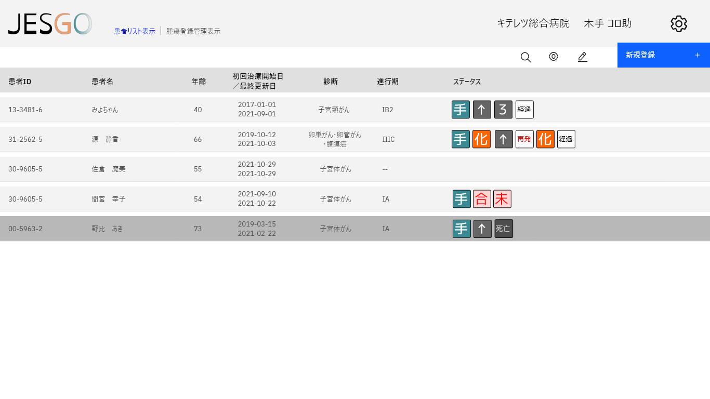
初期設定として、登録された症例レコードの一覧画面が表示される。


表示切り替えで、腫瘍登録の管理に特化した一覧画面を表示できる。


表示設定で、表示する期間、表示絞り込みの設定ができる。


また、情報の検索も可能。

### 8.3. 入力・編集・表示画面

新規の患者編集においては、レコードの最低限の情報を入力し、下のドキュメント表示部分のコントロールボタンでドキュメントを追加する。


一例として"/schema/CC/root"が展開された状態を示す。

### 8.4. スキーマ管理画面

スキーマ管理はドキュメントを構成するスキーマをツリー構造で表示、設定する。  
スキーマツリーはsubschemaで規定されたものについては順序の変更はできないが、その他のchildschemaについては変更が可能である。  
またコントロールボタンでの表示、非表示は候補表示のチェックボックスで制御される。subschemaで規定されたものについては自動展開されるので非表示設定はできない。しかし、subschemaであっても継承スキーマが存在する場合にはスキーマを選択と順序の変更が可能となる。候補スキーマとして両者が表示となっている場合の展開は、表示順が先のスキーマが優先される。その場合でもドキュメントのコントロールボタンでスキーマの切り替えは可能である。  
標準で上位スキーマが定まっていないものについても、リストの下位に表示されそれをドラッグして付随情報としてコントロールボタンから設定可能とできる。

### 8.5. ユーザ管理画面

一覧形式でユーザのログイン名、表示名称、ユーザロールテーブルで規定された権限を選択指定できる。


