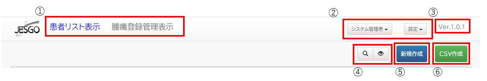
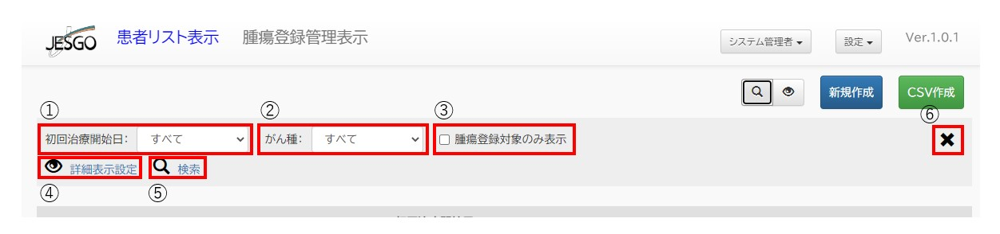
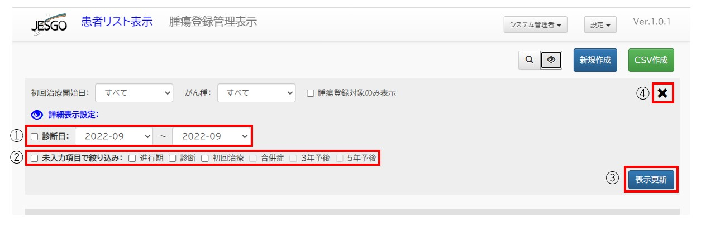
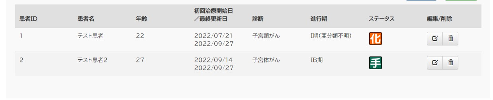
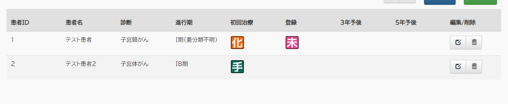

# 婦人科悪性腫瘍総合入力システム(JESGO) 患者リスト表示仕様書

<table style="margin-top: 5rem; margin-left: auto; margin-right: auto;">
<tr><td>初版(1.0)</td><td>2022-09-28 小坂</td></tr>
</table>

## 1. 履歴

### Version 1.0 初版

## 2. 画面図

### 2.1. 共通部

#### 2.1.1. ヘッダ

1. リスト表示切替
   症例レコードの表示形式を切り替える。現在選択中の表示形式が青字で表示される。
   各表示形式の詳細は後述。
   初期表示は「患者リスト表示」とする。

2. ユーザメニュー、管理メニュー
   ユーザメニュー部にはログインしているユーザの名称が表示される。
   クリックすることで、パスワードの変更、ログアウトが行える。
   管理メニュー部には権限に応じて「利用者管理」、「スキーマ管理」、「システム設定」の 3 つが表示される。
   押下することでそれぞれの管理画面に遷移する。

3. バージョン表示
   現在使用している JESGO のバージョンが表示される。

4. 検索切替
   虫眼鏡のマークを押下すると検索メニューが表示される。
   眼のマークを押下すると詳細表示設定メニューが表示される
   両メニューに関しては後述。

5. 新規作成ボタン
   ボタンを押下すると症例入力画面へ遷移する。

6. CSV 作成ボタン
   ボタンを押下すると現在リストに表示されている患者の一覧を CSV でダウンロードできる。
   内容は患者リスト表示、腫瘍登録管理表示共通で、それぞれに表示されている内容が含まれる。
   ファイル名には現在の年月日時刻を使用し、いつ出力したものかを分かるようにする。

#### 2.1.2. 検索メニュー

1. 初回治療開始日
   初回治療開始日の検索条件を設定する。
   選択肢はすべて(初期選択)、現在の年から過去 2 年までの 3 年分とする。

2. がん種
   がん種の検索条件を設定する。
   がん種の選択肢はすべて(初期選択)と、スキーマ上で cancer_major, cancer_minor のタグが付けられているものとする。
   cancer_major 由来の物を優先的に上位に表示する。

3. 腫瘍登録対象のみ表示
   チェックボックスをいれて検索すると登録拒否に設定されている症例を表示しない。

4. 詳細表示設定
   押下すると詳細表示メニューを表示する。

5. 検索
   押下すると指定した条件に従い検索、表示の更新を行う。

6. 閉じるボタン
   押下すると検索メニューを閉じる。

#### 2.1.3. 詳細表示メニュー

1. 診断日
   チェックボックスにチェックをいれ、選択肢を指定して表示更新すると診断日がその期間に含まれている症例のみを表示する。
   選択肢は現在の月から過去 11 か月までの 12 か月分とする。

2. 未入力項目で絞り込み
   一番左のチェックボックスにチェックをいれ、各項目のチェックボックスにチェックをいれて表示更新するとその項目が未入力である症例のみを表示する。
   項目は進行期、診断、初回治療のみとし、合併症、3 年予後、5 年予後の項目は現在指定不可とする。

3. 表示更新
   押下すると指定した条件に従い検索、表示の更新を行う。
   その際、詳細表示メニューのみではなく検索メニューの選択も加味した上での検索を行う。

4. 閉じるボタン
   押下すると検索メニュー、詳細表示メニューの両方を閉じる。

### 2.2. リスト表示部

#### 2.2.1. 患者リスト表示

表示項目は後述

#### 2.2.2. 腫瘍登録管理表示

表示項目は後述

#### 2.2.3. 共通表示項目

1. 患者 ID
   症例に設定されている患者 ID を表示する。

2. 患者名
   患者氏名をフルネームで表示する。

3. 診断
   cancer_major, cancer_minor のタグが設定された項目の内容を表示する。
   複数ある場合は cancer_major の項目を上位にすべて表示を行う。

4. 進行期
   figo のタグが付けられている項目の入力内容を表示する。
   複数ある場合は複数表示する。

5. 編集/削除ボタン
   該当の症例の編集、削除を行う。
   それぞれログイン中のユーザに権限があるときにのみ表示される。

6. 背景色
   死亡済の症例は行背景をダークグレーで表示する。

#### 2.2.4. 患者リストのみの表示

1. 年齢
   生年月日と現在日時から算出した現在の年齢を表示する。
   対象症例が死亡済の場合、死亡日時の年齢を表示する。

2. 初回治療開始日／最終更新日

   - 初回治療開始日
     initial_treatment_date のタグが設定された項目の日付を表示する。
     複数の項目がある場合、一番早い日付を表示する。

   - 最終更新日
     該当の症例で最後に登録、更新のあった日付を表示する。

3. ステータス
   症例の保有する状態により複数の項目を表示する。

- 「死亡」：患者が死亡していることを表す。死亡日が設定されている際に表示される。
- 「手」：手術療法を行っていることを表す。treatment_surgery のタグが付いた項目が入力されている際に表示される。
- 「化」：化学療法を行っていることを表す。treatment_chemo のタグが付いた項目が入力されている際に表示される。
- 「放」：放射線療法を行っていることを表す。treatment_radio のタグが付いた項目が入力されている際に表示される。
- 「緩和」：緩和療法を行っていることを表す。treatment_supportivecare のタグが付いた項目が入力されている際に表示される。
- 「再発」：再発が起きていることを表す。recurrence のタグが付いたドキュメントが存在している際に表示される。

#### 2.2.5. 腫瘍登録管理のみの表示

1. 初回治療
   初回治療に使用した療法をアイコンであらわす。
   treatment_surgery, treatment_chemo, treatment_radio, treatment_supportivecare いずれかのタグが含まれている項目が入力されていて、
   かつ再発指定の項目でない場合それらのアイコンを表示する。
   複数存在する場合、すべて表示を行う。

2. 登録
   症例に登録拒否が設定されている場合は最優先で「拒否」を表示する。
   registrability のタグが付いている項目が「はい」且つ、registration_number のタグが付いている項目が入力されている場合、「済」を表示する。
   registrability のタグが付いている項目が「はい」且つ、registration_number のタグが付いている項目が入力されていない場合、「未」を表示する。
   複数の条件が成り立つ場合、「拒否」>「未」>「済」の優先順で 1 つのみ表示を行う。
3. 3 年予後
   three_year_prognosis を含むドキュメントが登録されており、かつ該当の項目が入力済であれば「済」を表示する。
   three_year_prognosis を含むドキュメントが登録されており、かつ該当の項目が未入力であれば「未」を表示する。
   ただし、初回治療日が未指定か、初回治療日から 3 年がたっていない場合、何も表示しない。
   「未」と「済」の両方の条件が成り立つ場合、「未」>「済」の優先順で 1 つのみ表示を行う。

4. 5 年予後
   five_year_prognosis を含むドキュメントが登録されており、かつ該当の項目が入力済であれば「済」を表示する。
   five_year_prognosis を含むドキュメントが登録されており、かつ該当の項目が未入力であれば「未」を表示する。
   ただし、初回治療日が未指定か、初回治療日から 3 年がたっていない場合、何も表示しない。
   「未」と「済」の両方の条件が成り立つ場合、「未」>「済」の優先順で 1 つのみ表示を行う。
